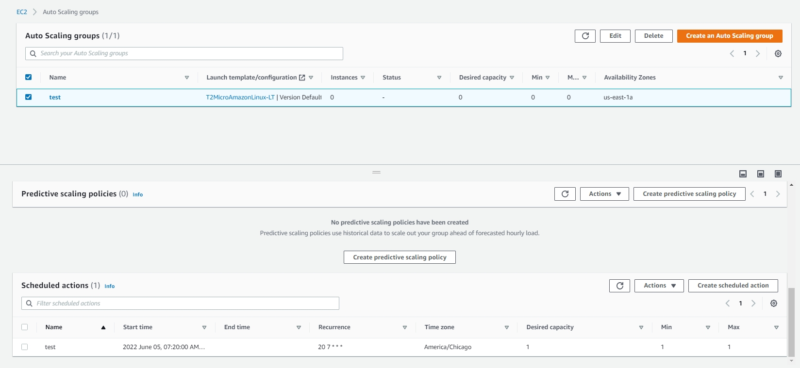

# Auto Scaling Group:

Q: How can you launch 3 ec2 instances in 3 separate AZs at once?

A: Create a Launch Template with Spread/ Partition placement group
Create ASG select subnets in different AZs, enter 3 as desired capacity
and 3 as max capacity and Create it without any target tracking scaling
policy. It will launch 3 instances with 3 AZs. Point to note we just
need to delete the ASG to terminate the instances.

Q: How can we launch a number of instances based on a time range?

A: After creating an auto scaling group we can create scheduled scaling
policy, This option is not available during the time of creation. Its
kind of overwrite the actual policy based on time condition. Also for
every task we have to create single policy. Such as to launch in
specific time 1 policy to stop in specific time another policy.

