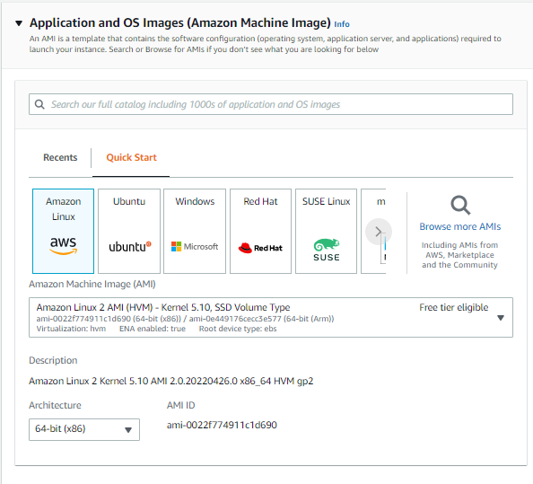
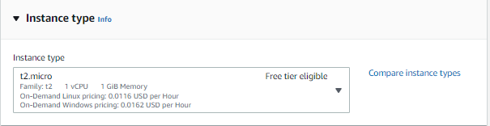
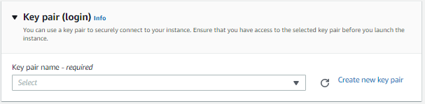
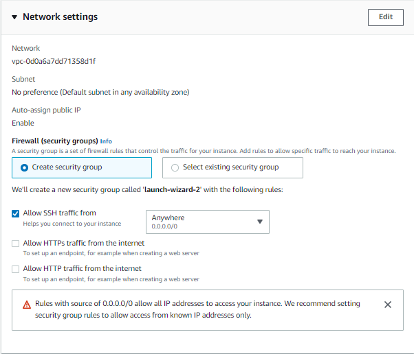
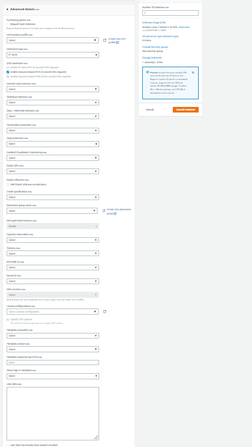
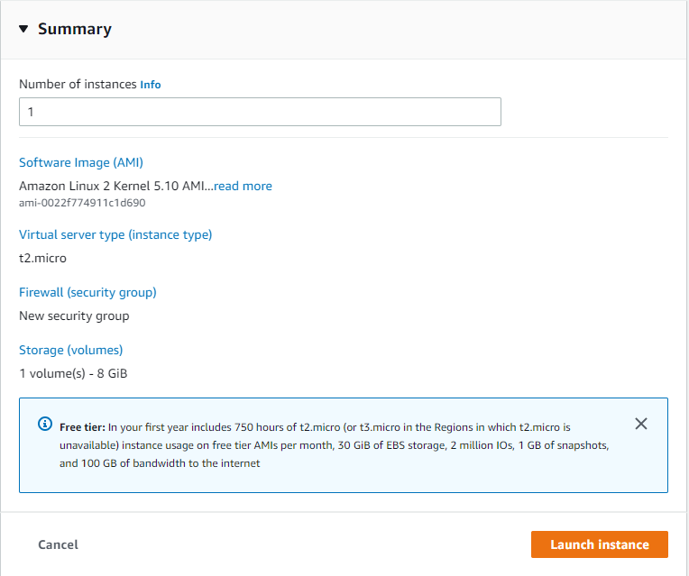

## EC2 Instances Purchasing Options

• **On-Demand Instances:** short workload, predictable pricing

• **Reserved:** (MINIMUM 1 year)

• **Reserved Instances:** long workloads

• **Convertible Reserved Instances:** long workloads with flexible
instances

• **Scheduled Reserved Instances:** example – every Thursday between 3
and 6 pm

• **Spot Instances:** short workloads, cheap, can lose instances (less
reliable)

• **Dedicated Hosts:** book an entire physical server, control instance
placement

• **Dedicated Instances:** no other customers will share your hardware

## Steps to launch a EC2:

1.  Name & Tag

2.  Select AMI & Architecture:

>  style="width:6.1875in;height:5.61458in" />

3.  Select Instance Type:

>  style="width:6.30208in;height:1.625in" />

4.  Select Key Pair:

>  style="width:6.32292in;height:1.55208in" />

5.  Select Network Setting: VPC, Subnet, IP, Firewall(Security Group)-
    Rules: 

6.  Configured Storage:

>  style="width:6.29167in;height:2.53125in" />

7.  Advanced Details: IAM Instance profile, Hostname Type (IP / Resource
    Name), shutdown behavior, termination protection, user data:

>  style="width:5.08403in;height:9in" />

8.  Summary Launch Instance:

## EC2 Instance Types:

-   R: applications that needs a lot of RAM - in-memory cache

-   C: applications that need good CPU - compute/database

-   M: applications that are balanced - general / web app

-   I: applications that need good local I/O - databases

-   G: applications that need GPU - video rendering / ML

-   T2/T3 - burstable instances

-   T2/T3 unlimited: unlimited burst
