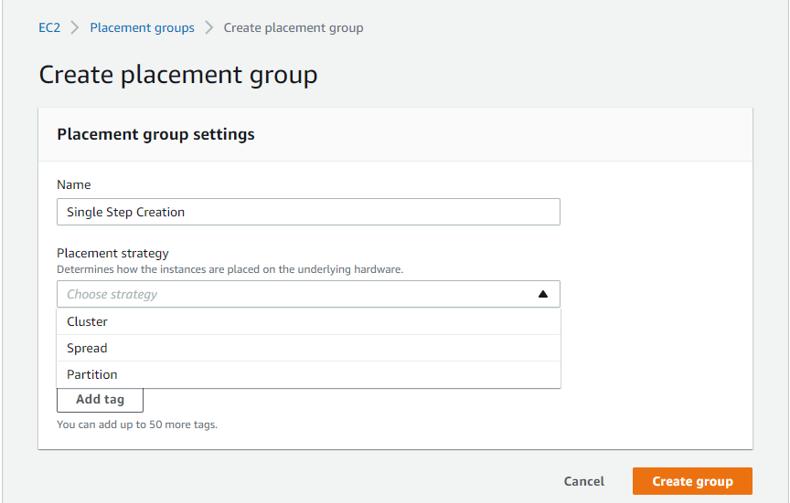

## EC2 Instances Purchasing Options

• **On-Demand Instances:** short workload, predictable pricing

• **Reserved:** (MINIMUM 1 year)

• **Reserved Instances:** long workloads

• **Convertible Reserved Instances:** long workloads with flexible
instances

• **Scheduled Reserved Instances:** example – every Thursday between 3
and 6 pm

• **Spot Instances:** short workloads, cheap, can lose instances (less
reliable)

• **Dedicated Hosts:** book an entire physical server, control instance
placement

• **Dedicated Instances:** no other customers will share your hardware

## Steps to launch a EC2:

1.  Name & Tag

2.  Select AMI & Architecture:

>  style="width:6.1875in;height:5.61458in" />

3.  Select Instance Type:

>  style="width:6.30208in;height:1.625in" />

4.  Select Key Pair:

>  style="width:6.32292in;height:1.55208in" />

5.  Select Network Setting: VPC, Subnet, IP, Firewall(Security Group)-
    Rules: 

6.  Configured Storage:

>  style="width:6.29167in;height:2.53125in" />

7.  Advanced Details: IAM Instance profile, Hostname Type (IP / Resource
    Name), shutdown behavior, termination protection, user data:

>  style="width:5.08403in;height:9in" />

8.  Summary Launch Instance:

## EC2 Instance Types:

-   R: applications that needs a lot of RAM - in-memory cache

-   C: applications that need good CPU - compute/database

-   M: applications that are balanced - general / web app

-   I: applications that need good local I/O - databases

-   G: applications that need GPU - video rendering / ML

-   T2/T3 - burstable instances

-   T2/T3 unlimited: unlimited burst

## Placement Groups:

-   Sometimes we want to control how the EC2 instances are placed in the
    AWS infrastructure

-   When we create a placement group, we can specify one of the
    following placement strategies:

    -   **Cluster** - cluster instances into a low-latency group in a
        single AZ

    -   **Spread** - spread instances across underlying hardware (max 7
        instances per group per AZ)

    -   **Partition** - spread instances across many different
        partitions (which rely on different sets of racks) within an AZ.
        Scale to 100s of EC2 instances per group (Hadoop, Cassandra,
        Kafka)

**Placement Groups - Cluster**

-   Pros: Great network (10Gbps bandwidth between instances)

-   Cons: if the rack fails, all instances fail at the time

-   Use cases:

    -   Big data job that needs to complete fast

    -   Application that needs extremely low latency and high network
        throughput

**Placement Groups - Spread**

-   Pros:

    -   Can span across multiple AZs

    -   Reduces risk for simultaneous failure

    -   EC2 instances are on different hardware

-   Cons:

    -   Limited to 7 instances per AZ per placement group

-   Use case:

    -   Application that needs to maximize high availability

    -   Critical applications where each instance must be isolated from
        failure

**Placement Groups - Partitions**

-   Pros:

    -   Up to 7 partitions per AZ

    -   Can have hundreds of EC2 instances per AZ

    -   The instances in a partition do not share racks with the
        instances from other partitions

    -   A partition failure can effect many instances but they wont
        affect other partitions

    -   Instances get access to the partition information as metadata

-   Use cases: HDFS, HBase, Cassandra, Kafka

