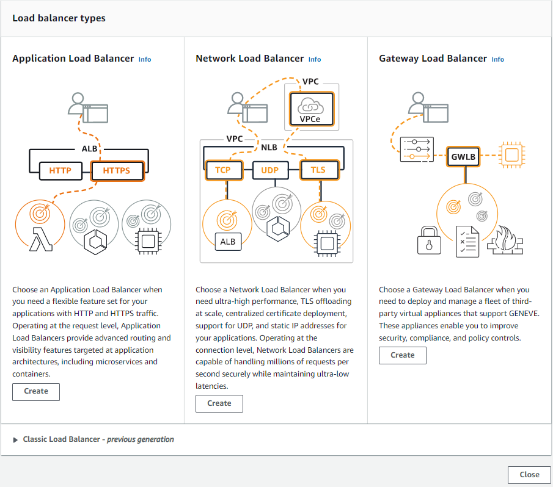
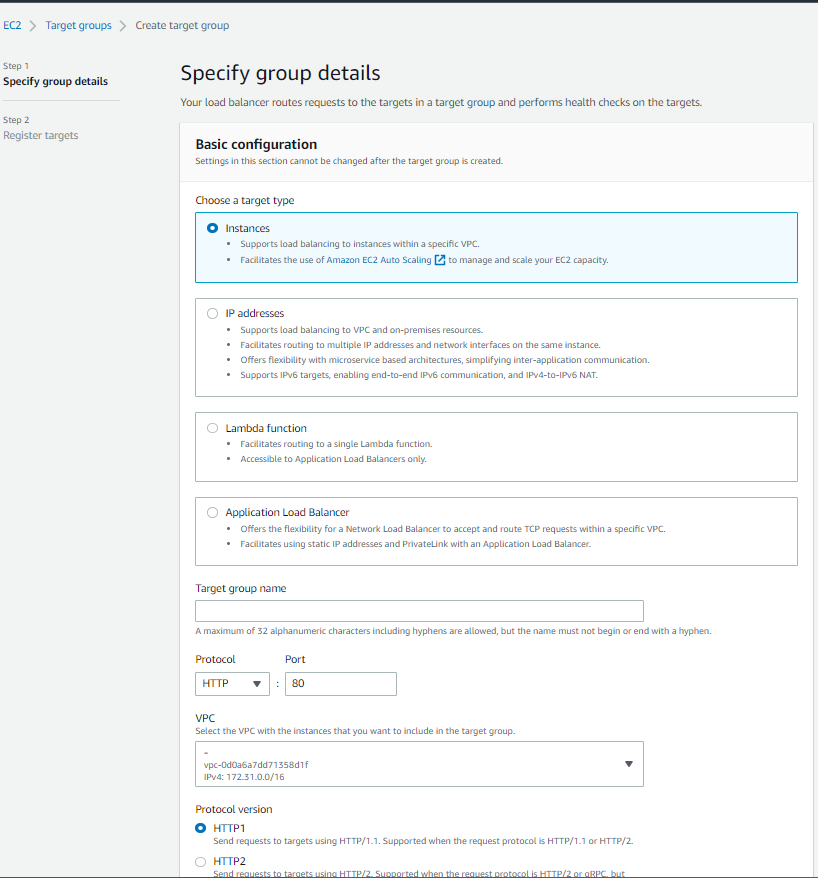
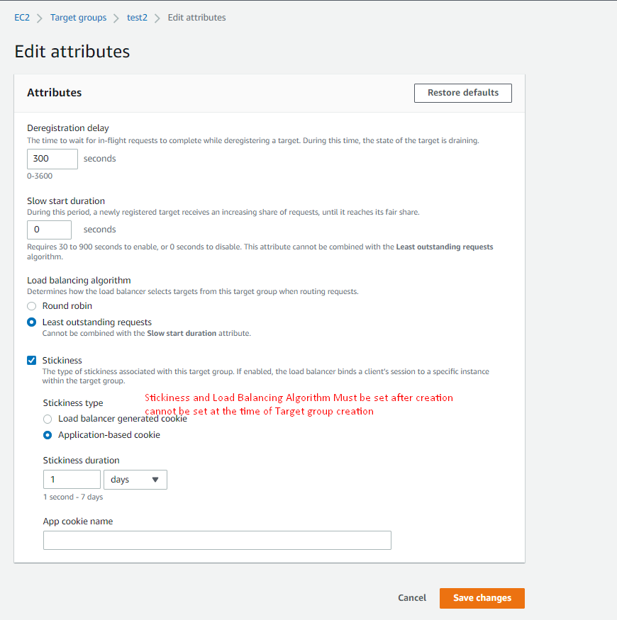
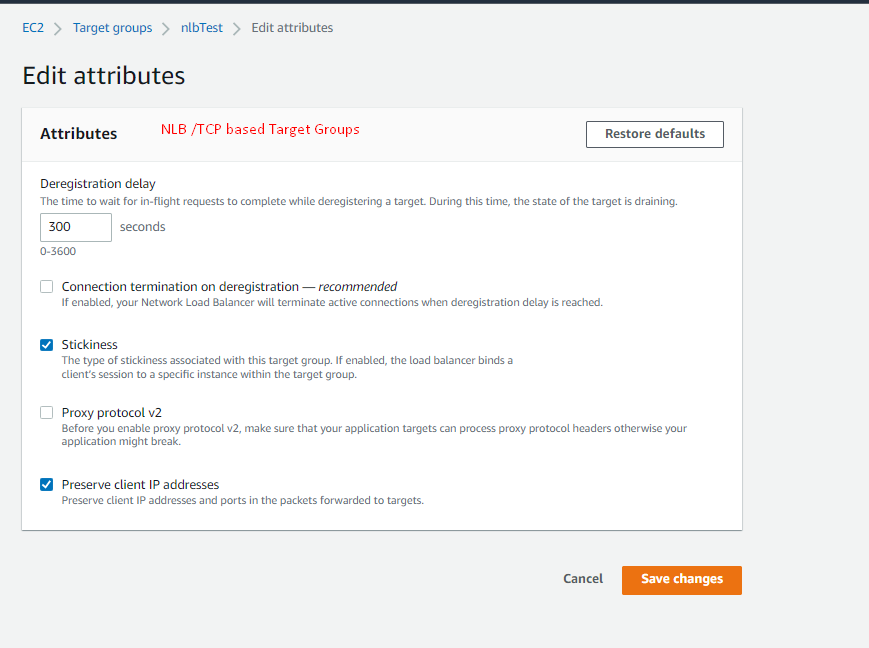

# Types of load balancer on AWS

AWS has 4 kinds of managed Load Balancers

1.  Classic Load Balancer (v1 - old generation) – 2009 – CLB

> • HTTP, HTTPS, TCP, SSL (secure TCP)

2.  Application Load Balancer (v2 - new generation) – 2016 – ALB

> • HTTP, HTTPS, WebSocket

3.  Network Load Balancer (v2 - new generation) – 2017 – NLB

> • TCP, TLS (secure TCP), UDP

4.  Gateway Load Balancer – 2020 – GWLB

> • Operates at layer 3 (Network layer) – IP Protocol

# Application Load Balancer (v2)

-   Application load balancers is Layer 7 (HTTP)

<!-- -->

-   Load balancing to multiple HTTP applications across machines (target
    groups)

-   Load balancing to multiple applications on the same machine (ex:
    containers)

<!-- -->

-   Support for HTTP/2 and WebSocket

-   Support redirects (from HTTP to HTTPS for example)

## Routing tables to different target groups:

-   Routing based on path in URL (example.com/users & example.com/posts)

-   Routing based on hostname in URL (one.example.com &
    other.example.com)

-   Routing based on Query String, Headers
    (example.com/users?id=123&order=false)

-   Routing based on Source IP.

# Network Load Balancer (v2) (**Layer 4**):

## When to Use NLBs:

-   Forward **TCP & UDP** traffic.

-   Handle millions of requests per seconds. Used for **extreme
    performance**, TCP or UDP traffic

-   To achieve **low latency** \~100 ms (vs 400 ms for ALB).

-   NLB has one static IP per AZ, and supports assigning Elastic IP but
    **ALB does not support Elastic IP** (helpful for **whitelisting**
    specific IP)

-   **Source IP directly forwarded to target. Target’s SG must allow
    traffic from specific/ all source.**

# Gateway Load Balancer:

To analyze the traffic for any kind of malicious activities Gateway Load
Balancer is used.

-   Deploy, scale, and manage a fleet of 3rd party network virtual
    appliances in AWS

-   Example: Firewalls, Intrusion Detection and Prevention Systems, Deep
    Packet Inspection

-   Systems, payload manipulation, …

-   Operates at **Layer 3** (Network Layer) – IP Packets

Combines the following functions:

-   Transparent Network Gateway – single entry/exit for all traffic

-   Load Balancer – distributes traffic to your virtual appliances

-   Uses the **GENEVE protocol on port 6081**

## Target Groups: 

**Target Groups are same for any type of ELB but for NLB you can only
choose TCP or UDP protocol.**

1.  Instances

-   Supports load balancing to instances within a specific VPC.

-   Facilitates the use of Amazon EC2 Auto Scaling to manage and scale
    your EC2 capacity.

2.  IP addresses

-   Supports load balancing to VPC and on-premises resources.

-   Facilitates routing to multiple IP addresses and network interfaces
    on the same instance.

-   Offers flexibility with microservice based architectures,
    simplifying inter-application communication.

-   Supports IPv6 targets, enabling end-to-end IPv6 communication, and
    IPv4-to-IPv6 NAT.

3.  Lambda function

-   Facilitates routing to a single Lambda function.

-   Accessible to Application Load Balancers only.

4.  Application Load Balancer

-   Offers the flexibility for a Network Load Balancer to accept and
    route TCP requests within a specific VPC.

-   Facilitates using static IP addresses and PrivateLink with an
    Application Load Balancer.

# Session Stickiness: 

**Have to enable from edit attributes of Target Group after creation of
the Target group.**

2 Types of Stickiness are available:

1.  Load Balancer Generated: Only duration based

2.  Application-based cookie: Duration and App Cookie name need to be
    provided.

# Load balancing algorithm:

**Have to enable from edit attributes of Target Group after creation of
the Target group.**

Determines how the load balancer selects targets from this target group
when routing requests.

-   Round robin (Default)

-   Least outstanding requests: Cannot be combined with the Slow start
    duration attribute.

For NLB/TCP/UDP traffic Target Groups there is no Load Balancing
Algorithm available and only can enable / disable Stickiness no
additional options available.

