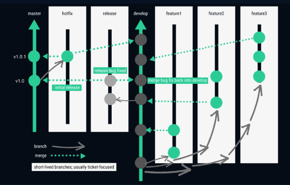
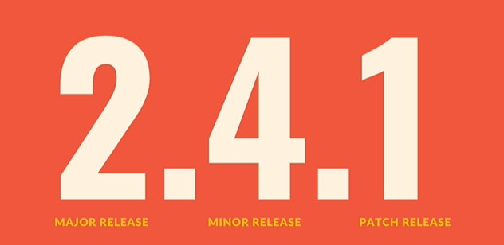
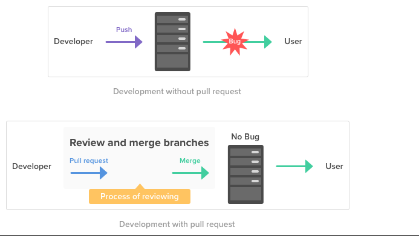

## Q: What is your git branching strategy?

A: We have multiple branches. The Stable branch is Master. Then we have
HOTFIX, Release, Develop and features. We tag our master branch with
stable release version.

Hotfix: for any prod issues we cut this branch from master, fix the prod
code and push it back.

Development: under these the main development codes are committed. Its
combination of Hotfix/Bugfix and feature branch.

Features: we cut the feature branch from development. Multiple
developers can work on different feature branch as required.

Release: Release branch is almost identical to our stable master branch.
It is also our stable branch. We deploy to different environment from
this branch. Only after passing all the test and

<https://www.youtube.com/watch?v=fCNX8yLcw2Q&ab_channel=ServerGyan>

Q: What are the tasks you perform in git?

A: Git for branching, tagging and version management. We do semantic
versioning.

Q: What is tag? How do you create it? What is the use case of it?

A: git tag tag_version_no. \# git tag V2.4.2

One important use case is to compare 2 release at once

Git diff v2.4.2 v2.3.2

\# git tag -a v17.3.0 annotated tag. Here we enter more metadata.

\# git show v17.3.0 will show the tagged users and message and more
info.

\# git tag -f v17.3.0 will force the tag change , remange

\# git tag -d v17.2.9 delete tag

\# git tag -f v17.2.5 commit_hash tag any specific commit.

\# git push –tag mush include –tag to push the tag to github. It won’t
be pushed by default.

Q: What type of access do you have in GIT/GITHUB?

A: I have read access in my project git repo.

Q: What is the pull request (PR) in GITHUB?

A: Whenever any commit has been made to any working branch such as
feature, that specific branch will be ahead of other branches. So, we
use pull request here based on our merging strategy to merge these
commits to the next available branch in the workflow.

-   Definition 1: Pull request is a process for a developer to notify
    team members that they have completed a feature.

-   Definition 2: A pull request is an event in Git where a contributor
    asks a maintainer of a Git repository to review code they want to
    merge into a project.

Q: What is git HEAD?

A: pointer that refers to the current location in your current branch.
So, in easy terminology we cannot work in 2 places at once (Like a book
mark we cannot open 2 pages of a book at once to read), so head it
referring to my current location. Different branches could have
different head.

[Top 40 Git Interview Questions and Answers \[Updated 2022\] \|
Simplilearn](https://www.simplilearn.com/tutorials/git-tutorial/git-interview-questions)
