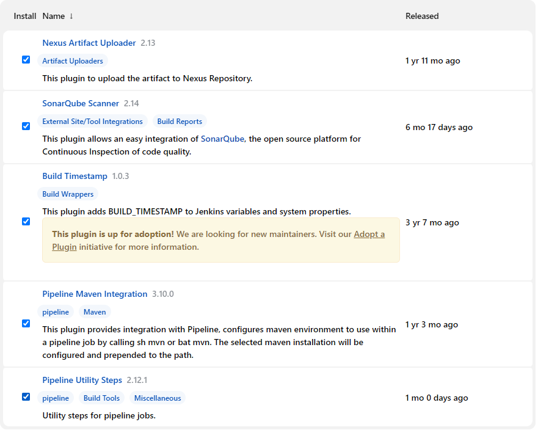
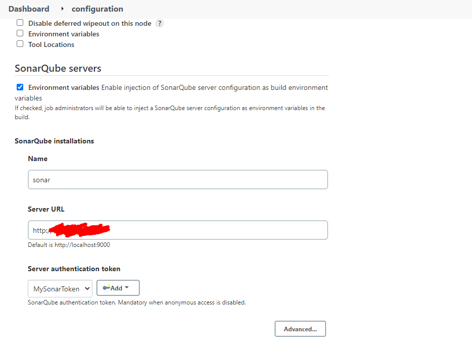
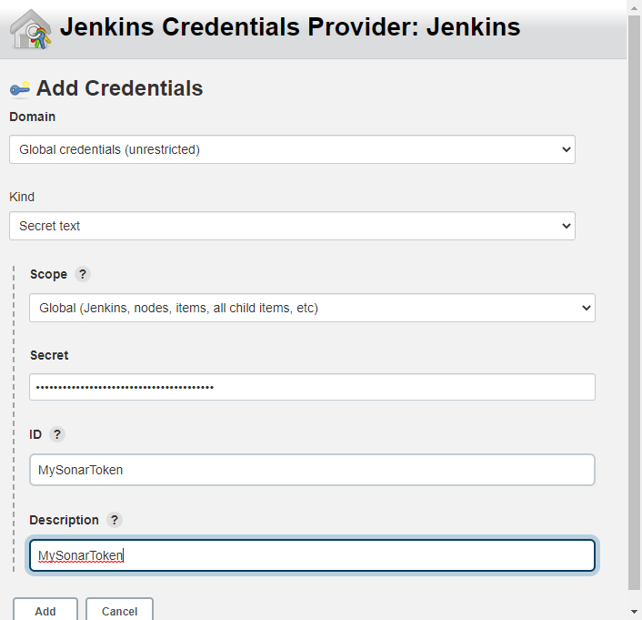

## 5/28/2022:

**Q: How to stop concurrent build?**

A: At the time of job creation, we have to select it.

**Q: What is job in Jenkins? What type of Jobs have you configured in
your project?**

A:

Free Style:

Pipe Line:

**Q: What is continues deliver?**

A: Delivery means deliver the build to end client to deploy to prod. In
99% of the time delivery is a manual process.

**Q: How will you verify the os distro with Jenkins before run a shell
script?**

A: isUnix command have to be implemented in the pipe line.

**Q: When do you run SonarQube test report- before or after build?**

A: We usually run it parallelly with the build.

**Q: Why don’t we use shell scripts for all the pipelines?**

A: Shell is a interpreter language. So it cannot run parallelly. It have
to run sequentially.

**Q: Can you explain what is the task of SonarQube?**

A:

**Q: if you want to build a maven project what option you will choose
from the build dropdown?**

A: Invoke to-level Maven Targets.

**Q: What Goals you use to build maven project?**

A: clean package

**Q: Where do you install maven?**

A: It can be done in both Linux env and Jenkins server. As a best
practice we do use Jenkins server maven configuration. One of the
benefits of it is we can use multiple maven version and configure the
job based on the required version.

**Q: What is the default path of Jenkins?**

A: /var/lib/Jenkins

**Q: Where do you enter the sonarqube url?**

A: pom.xml in the specific branch.

**Q: What is the Build goals of maven project with Sonaqube?**

A: clean package sonar:sonar

**Q: What is the Build Goals of maven project with both SonarQube and
Nexus?**

A: clean sonar:sonal deploy

**Q: Where do you save the nexus credentials?**

A: The url in the pom.xml file. 2 urls have to save one for release repo
another for snapshot.

Than we have to same the authentication token to maven installed
directory in Jenkins server. Inside conf dir \> settings.xml file

**Q: what is the default folder of tools installed by Jenkins global
configurator?**

A: /var/lib/Jenkins/tools

**Q: What is the plugin you use to deploy the artifact to tomcat
server?**

A: Deploy to container.

**Q: In How many ways you can trigger build automatically?**

A: 3 Ways

1.  Pool SCM: crontab runs

2.  Periodically:

3.  Github hook:

**Q: How Jenkins knows if the source code has been changed to GitHub?**

A: with the git commit ID.

**Q: What is the difference between tools and plugin?**

A: Manage Jenkins \> Global Tools configuration. It’s basically the
software we need to run the job. Such as java, maven etc.

**Q: Have you used any Global variable in Jenkins? If so, where?**

A: Yes, I have used global variable to do versioning of artifact through
shell script after build.

I have used $BUILD_ID

**Q: How you do versioning of your Artifact in Jenkins?**

A: I have used global variable to do versioning of artifact through
shell script after build.

I have used $BUILD_ID

**Q: What is a workspace?**

A:

**Q: What plugins did you use in your project?**

A:

-   Deploy to Container

-   Deploy WebLogic

-   Maven Integration

-   Safe Restart

-   Next Build Number

-   JACOCO

-   SSH Agent

-   Email Extension

>  style="width:6.5in;height:5.19444in" />

**Q: Can you explain the pipeline flow you made?**

A:

Dev Commit to GitHub Jenkins Pull the codes from Repo Maven Build the
code

Maven performs Junit Test SonarQube scan the codes and verify the
Quality Gate

Finally upload the Artifact to Nexus

Q: **what are the pipeline ways available?**

A: 2 types are there:

-   Scripted

-   Declarative We are using in our project.

Q: How to you integrate sonarqube with Jenkins?

A:

1.  Install sonar scanner plugin

2.  Under global tools select sonar scanner version and give it a name

3.  Configure server and add sonarqube server url, save it
    

4.  Come back to configure server and sonqube add token generated in
    sonarqube

5.  Remember at 1st you have to add the url to add the
    credential (token in this case)
