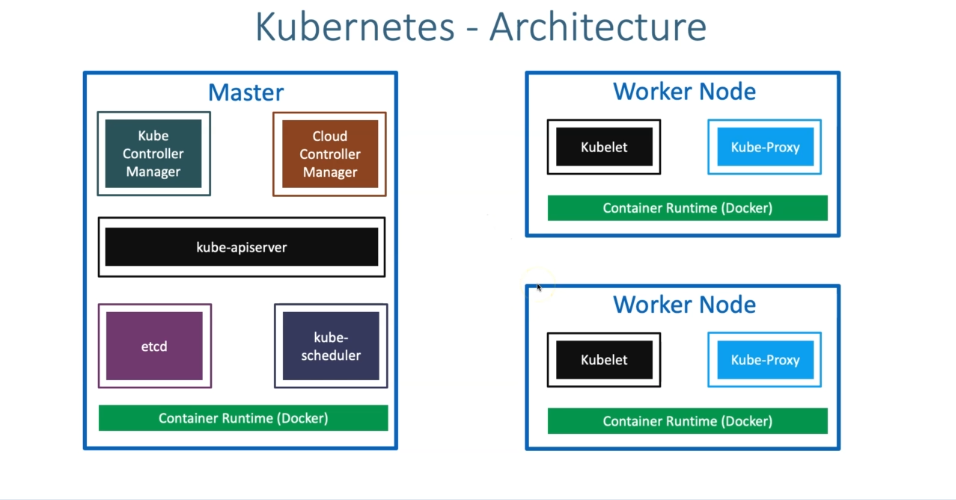
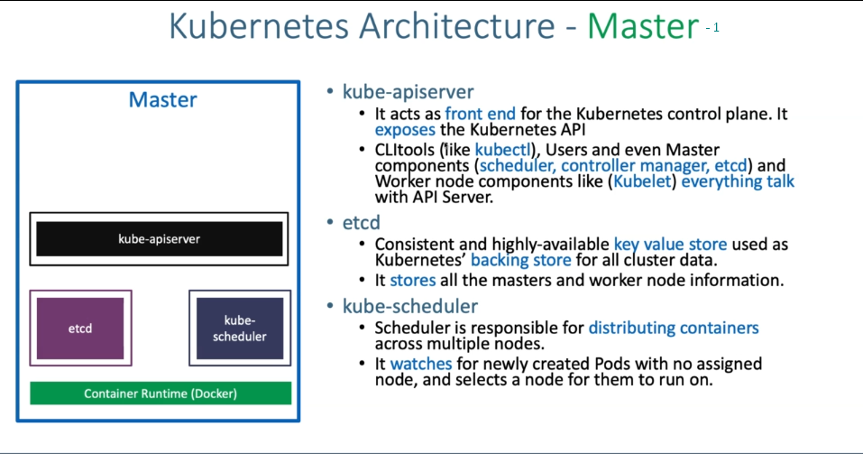
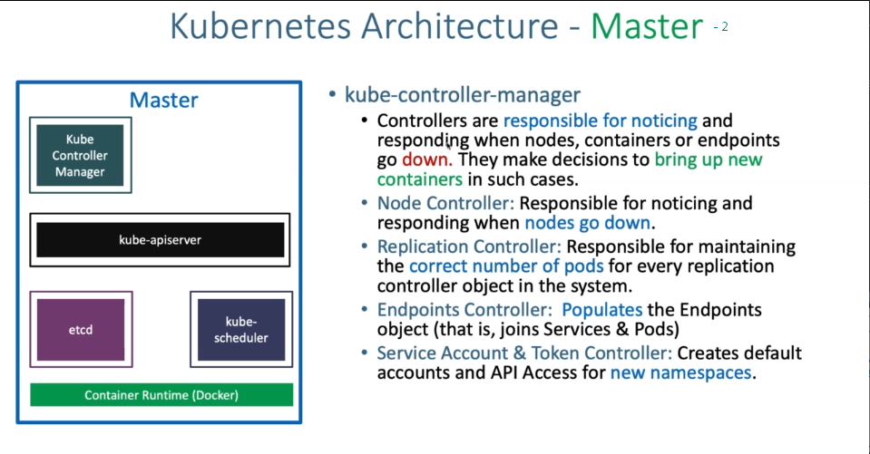
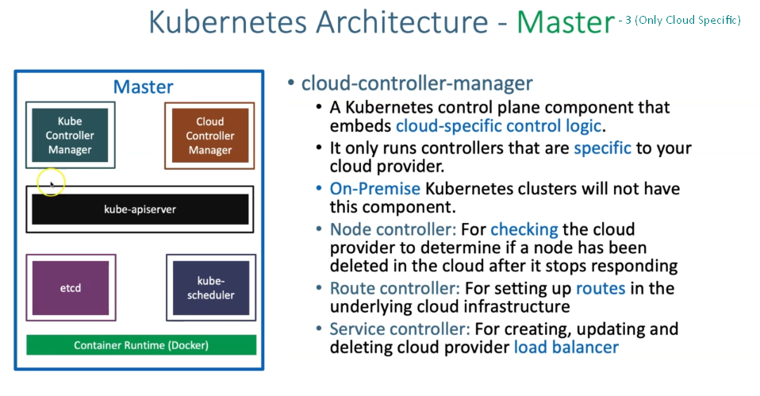
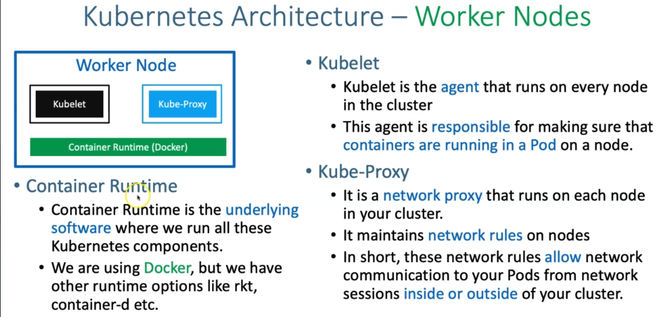
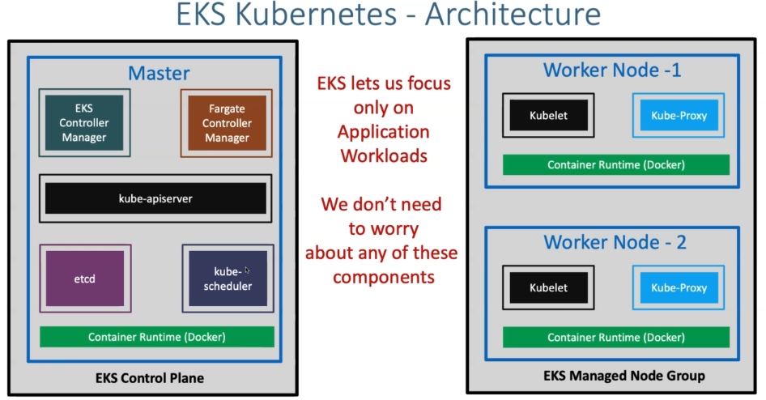

# Kubernetes Architecture

## Why Kubernetes:

## 

## Kubernetes Architecture:

## Kubernetes MASTER Architecture:

## Kubernetes WORKER Architecture:

# EKS Kubernetes Architecture:

EKS only have additional Fargate Controller manager to deploy serverless
workload but it let us focus on our application workloads only. We don’t
need to worry about any of the following component. The diagram is for
understanding only to create and manage the cluster but all the
components are fully managed by AWS we will only configure them based on
our requirement.

