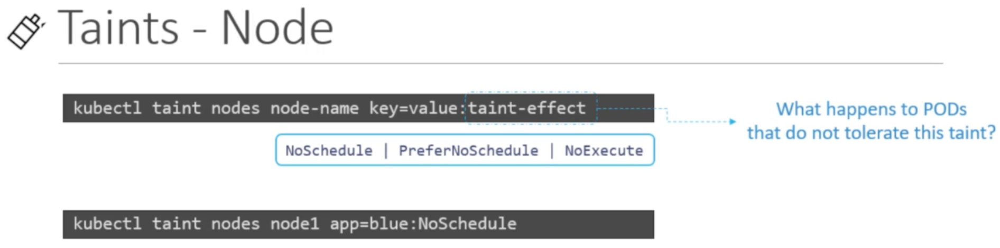

# K8s-Scheduling:

## Taints and Tolleration:

Taints are placed in Nodes:



Tollerations are placed on Pod as follows:

```yaml
apiVersion: v1 
kind: Pod 
metadata:
  name: simple-webapp 
  labels:
    app: App1 function: Front-end
spec:
  containers:
  - name: simple-webapp
  image: simple-webapp ports:
  - containerPort: 8080
  tolerations:
  - key: "app"
    operator: “Equal”
    value: "myapp"
    effect: "NoSchedule"
```
