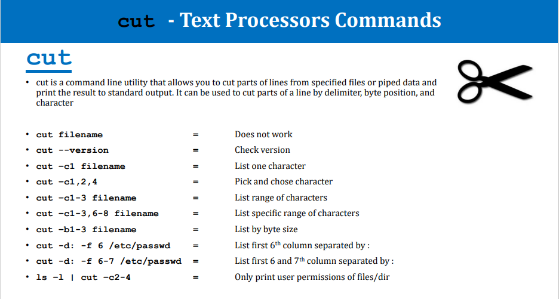
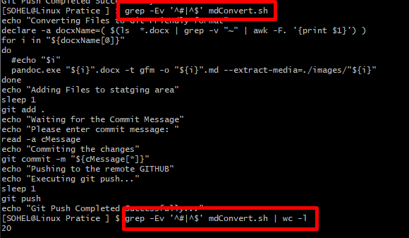

# Linux Important Commands Practice Notes:

## 5/28/2022:

**<u>\# cut commad:</u>**

**<u>\# grep command:</u>**

Problem: Write a command to count the number of code lines in a shell
script:

Solution: grep -Ev '^#\|^$' mdConvert.sh \| wc -l

