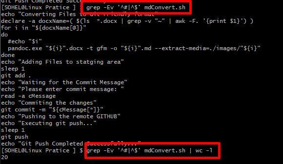
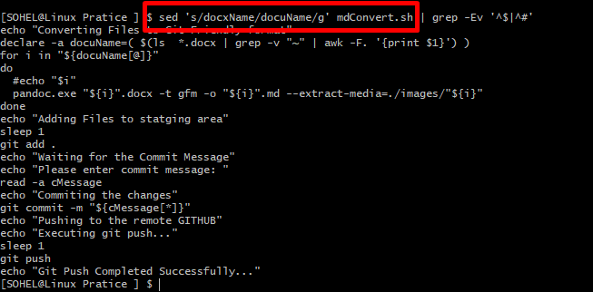
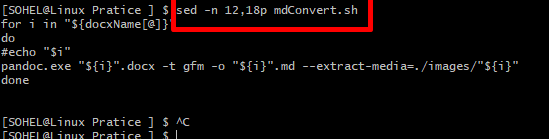
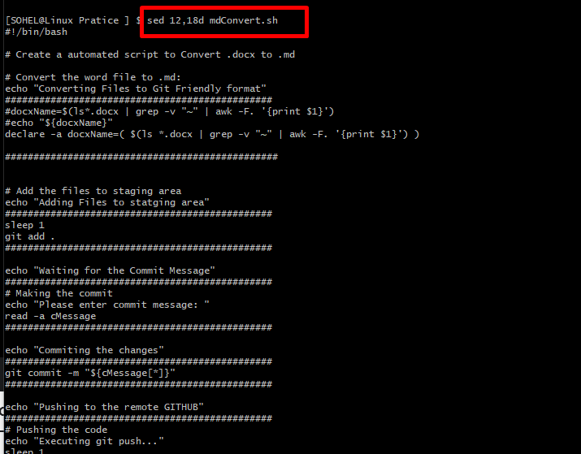
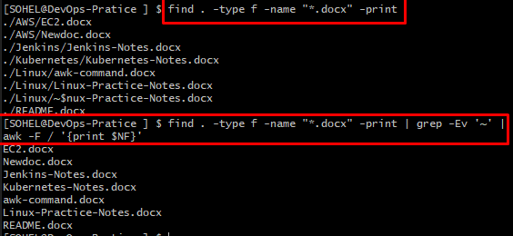

# Linux Important Commands Practice Notes:

### \# cut commad:

### \# grep command:

Problem 1 : Write a command to count the number of code lines in a shell
script:

Solution: grep -Ev '^#\|^$' mdConvert.sh \| wc -l

#### \# sed command:

Q: Replace a variable name globally inside a shell script.

A:

-   Change and Display output to screen: sed 's/docxName/docuName/g'
    mdConvert.sh

-   Change and Insert into the file: sed -i 's/docxName/docuName/g'
    mdConvert.sh

-   Change 1st occurrence of every line only: sed
    's/docxName/docuName/1'
    mdConvert.sh

Q: show a script from line 12 to 18 only.

A:

-   sed -n 12,18p mdConvert.sh

Q: show a script discard/hide line 12 to 18.

A:

-   sed 12,18d mdConvert.sh
    

*\# Find all the .docx file under current directory including sub
directory*

find . -type f -name "\*.docx" -print

*\# Then Delete tmp(\~) files and print the file names only:*

find . -type f -name "\*.docx" -print \| grep -Ev '\~' \| awk -F /
'{print $NF}'

